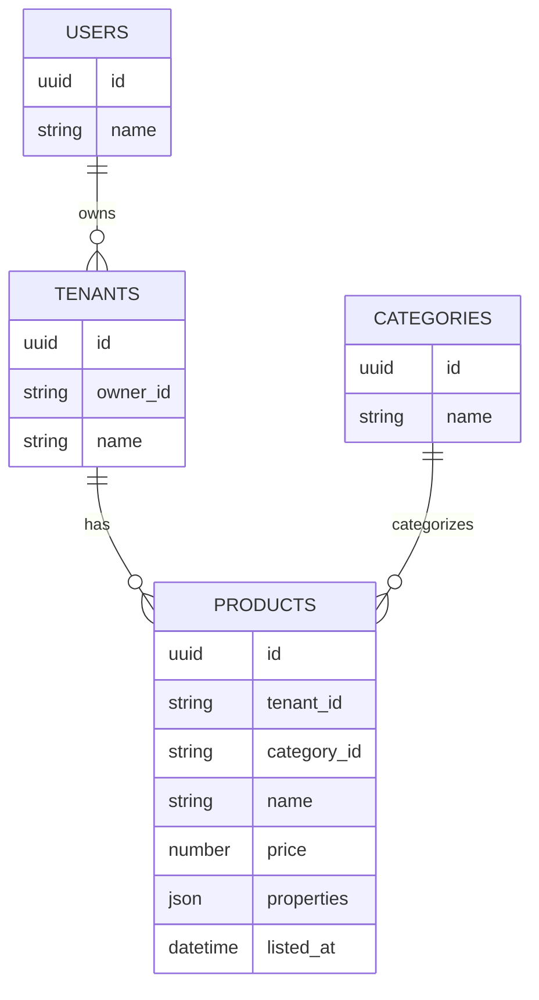

# ER図

以下の情報を元に、ent/schema内のファイルを作成する

# products の properties

spec/models/products_properties.yaml を参照
実装は domain/model/productProperties.go

# サンプルデータ

* 以下のサンプルデータを登録するプログラムを commands/seed-v2/main.go に作成する
* 先にCSVを作成し、LOAD DATA LOCAL INFILEを活用してレコードを作成する
* 先に各テーブルをTRUNCATEする
* SET FOREIGN_KEY_CHECKS=0
* sql_log_bin=0
* LOAD DATA LOCAL INFILE１回につきトランザクション１つとする
* productsテーブルについて、各種キーとインデックスの情報を取得・退避しておき、キーとインデックスを削除する。
    * レコード登録完了時に復元する
    * information_schema.STATISTICS や information_schema.KEY_COLUMN_USAGE などを活用する
    * PRIMARY KEYは削除対象外とする（削除すると復元が困難なため）

* users
    * 200レコード
    * name: `ユーザX` (Xは1からの連番)
* tenants
    * 1000レコード
    * name: `テナントX` (Xは1からの連番)
    * userを満遍なく紐付ける
* categories
    * 50レコード
    * name: `カテゴリX` (Xは1からの連番)
* products
    * 100万レコード
    * user, tenant, categoryを満遍なく紐付ける
    * name: `商品X` (Xは1からの連番)
    * price: 100〜10000の乱数(整数)
    * properties
        * size: yamlのenumの値をランダムに設定する
        * latitude: 20.43〜45.55の乱数(実数)
        * longitude: 122.93〜153.99の乱数(実数)
        * color: yamlのenumの値をランダムに設定する

# OpenSearch の products

* spec/openSearchScheme/products.json を参照
* OpenSearchはCQRSを実現するための検索用のストレージとして利用する
    * RDBのデータを正として、そのデータのコピーを検索に最適化した構造で保持する
* productsテーブルを軸とし、users,tenants,categoriesを非正規化して１つのドキュメントで保持する