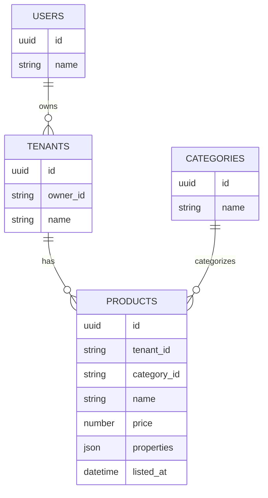

# ER図

以下の情報を元に、ent/schema内のファイルを作成する

# products の properties

spec/models/products_properties.yaml を参照
実装は domain/model/productProperties.go

# サンプルデータ

* 以下のサンプルデータを登録するプログラムを commands/seed-v2/main.go に作成する
* BulkInsertを活用して効率よくレコードを作成する

* users
    * 200レコード
    * name: `ユーザX` (Xは1からの連番)
* tenants
    * 1000レコード
    * name: `テナントX` (Xは1からの連番)
    * userを満遍なく紐付ける
* category
    * 50レコード
    * name: `カテゴリX` (Xは1からの連番)
* products
    * 100万レコード
    * user, tenant, categoryを満遍なく紐付ける
    * name: `商品X` (Xは1からの連番)
    * price: 100〜10000の乱数(整数)
    * properties
        * size: yamlのenumの値をランダムに設定する
        * latitude: 20.43〜45.55の乱数(実数)
        * longitude: 122.93〜153.99の乱数(実数)
        * color: yamlのenumの値をランダムに設定する