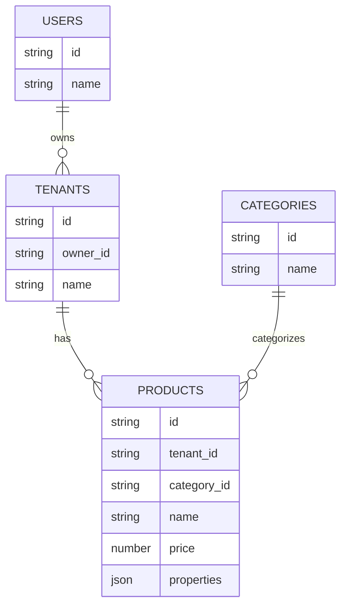

# ER図

以下の情報を元に、ent/schema内のファイルを作成する

```mermaid
erDiagram
    USERS {
        string id
        string name
    }

    TENANTS {
        string id
        string owner_id
        string name
    }

    PRODUCTS {
        string id
        string tenant_id
        string category_id
        string name
        number price
        json properties
    }

    CATEGORIES {
        string id
        string name
    }

    USERS ||--o{ TENANTS : owns
    TENANTS ||--o{ PRODUCTS : has
    CATEGORIES ||--o{ PRODUCTS : categorizes

```

# products の properties

spec/models/products_properties.yaml を参照